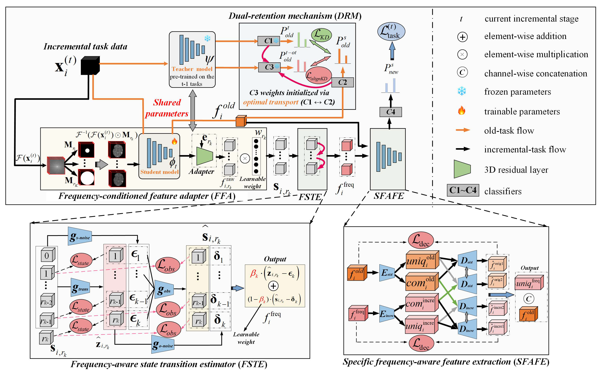

# FADRNet: This repository provides a PyTorch implementation of the paper "Frequency-aware dual retention network for incremental glioma classification"

## Overview
This repository contains the official implementation of **FADRNet**, introduced in our paper:  
**"Frequency-aware dual retention network for incremental glioma classification"**  

Glioma classification tasks such as IDH mutation, 1p/19q codeletion, and WHO grading rely on heterogeneous frequency-specific imaging cues. Conventional incremental learning methods assume a shared feature space, which hinders performance when transferring to new tasks. Moreover, strict privacy regulations prevent storing or replaying historical data, making replay-based methods impractical in clinical settings.  

To address these challenges, FADRNet:  
- Constructs **task-specific subspaces** guided by frequency information.  
- Introduces a **dual-retention mechanism** that preserves old-task knowledge without replay.  
- Achieves **state-of-the-art adaptability** on new tasks while maintaining prior-task performance across multi-center datasets (>1,800 cases).  

<figure>
  
  <figcaption>Figure 1: The overall workflow of the proposed FADRNet.</figcaption>
</figure>

---

## Key Features
- **Frequency-conditioned Feature Adapter (FFA):** Emphasizes task-relevant frequency responses.  
- **Frequency-aware State Transition Estimator (FSTE):** Models cross-band evolution and suppresses frequency noise.  
- **Specific Frequency-aware Feature Extraction (SFAFE):** Extracts residual frequency cues overlooked by the old-task branch.  
- **Dual-Retention Mechanism (DRM):** Preserves prior-task knowledge by combining output-level distillation with classifier optimal transport alignment.  

---

## Repository Structure
```
FADRNet/
│
├── dataLoder/                # Data loading modules
│   ├── dataload_t1c.py       # T1C MRI dataset loader
│   ├── dataload_t1c_freq.py  # Frequency-partitioned T1C loader
│   └── incremental_datasets.py # Incremental dataset management
│
├── model/                    # Core model implementation
│   ├── Backbone/             # Backbone and network building blocks
│   │   ├── _FADRNet.py       # FADRNet full architecture
│   │   ├── _PreIncrNet.py    # Pre-incremental base model
│   │   └── ...
│   ├── 1.Train_PreIncrNet.py # Training script for base model
│   ├── 2.Train_FADRNet.py    # Training script for incremental tasks
│   └── config.py             # Configuration file
│
└── README.md                 # Project documentation
```

---

## Data Acquisition & Preprocessing

This project uses public datasets and a preprocessing pipeline adapted from our previous repository:  
https://github.com/ChiChienMile/CMTLNet/tree/main

### Datasets
- REMBRANDT: http://doi.org/10.7937/K9/TCIA.2015.588OZUZB
- LGG-1p/19q: http://doi.org/10.7937/K9/TCIA.2017.DWEHTZ9V
- UCSF-PDGM: http://doi.org/10.7937/tcia.bdgf-8v37
- Segmentation for LGG-1p/19q: http://dx.doi.org/10.17632/rssf5nxxby.1
- Additional: BraTS (MI-20) http://braintumorsegmentation.org/, EGD (774 pts) https://xnat.bmia.nl/REST/projects/egd

### Preprocessing Steps (summary)
1) **DICOM -> NIfTI** using MRIConvert (https://idoimaging.com/programs/214).  
2) **Template**: download SRI24 atlas (spgr_unstrip_lps.nii) from https://doi.org/10.7937/9j41-7d44.  
3) **Skull stripping & Registration**:  
   - Skull-strip both SRI atlas and subject MRIs with *FSL BET*.  
   - Register skull-stripped T1 to SRI (ANTsPy), then register skull-stripped T2 to the registered T1.  
   - Scripts & example data: `preprocessing/1_registration.py`, `preprocessing/regdata/` (includes `spgr_unstrip_lps_b.nii.gz`).  
4) **Crop & Pad** to 160×192×160 voxels.  
   - Script: `preprocessing/2_cutbackground.py`, examples in `preprocessing/cropdata/`.

> External software required for preprocessing: MRIConvert, FSL (BET), and ANTs/ANTsPy.  
> After preprocessing, use `dataLoder/` loaders to build incremental datasets.

---

## Requirements

Install dependencies with:
```bash
pip install -r requirements.txt
```

Key dependencies:
- Python ≥ 3.6.13  
- torch==1.10.1, torchvision==0.11.2, torchaudio==0.10.1  
- monai==0.8.1  
- nibabel==3.2.2  
- scikit-image==0.17.2  
- scikit-learn==0.24.2  
- SimpleITK==2.1.1.2  
- numpy==1.19.5, scipy==1.5.4  
- matplotlib, pandas, tqdm, PyYAML  

See [requirements.txt](requirements.txt) for the complete list.

---

## Training

### 1. Train the base model (PreIncrNet)
```bash
python model/1.Train_PreIncrNet.py
```

### 2. Train FADRNet incrementally
```bash
python model/2.Train_FADRNet.py
```

---
